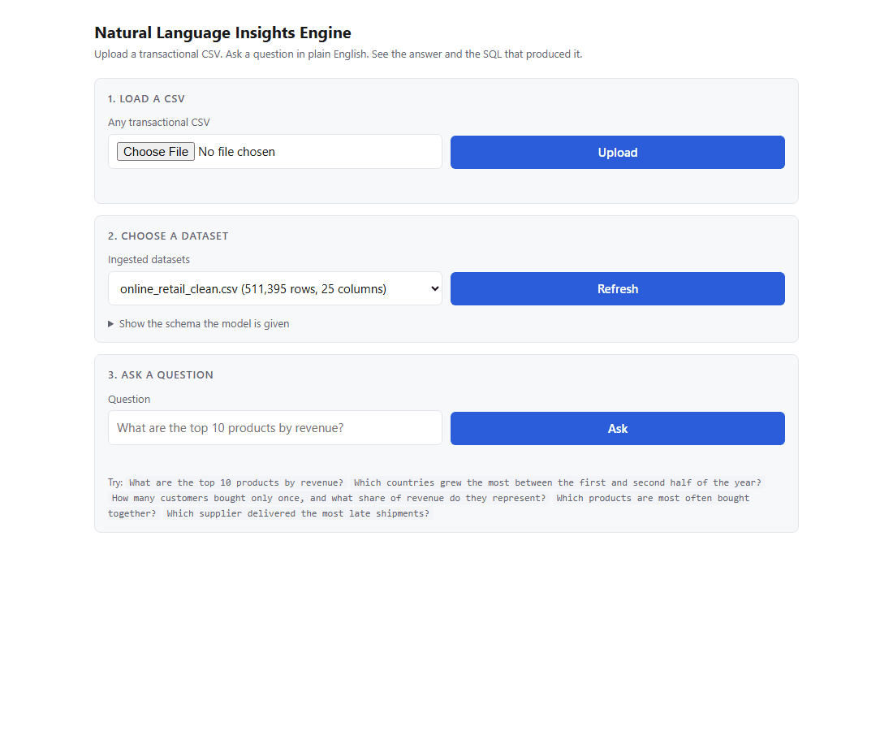
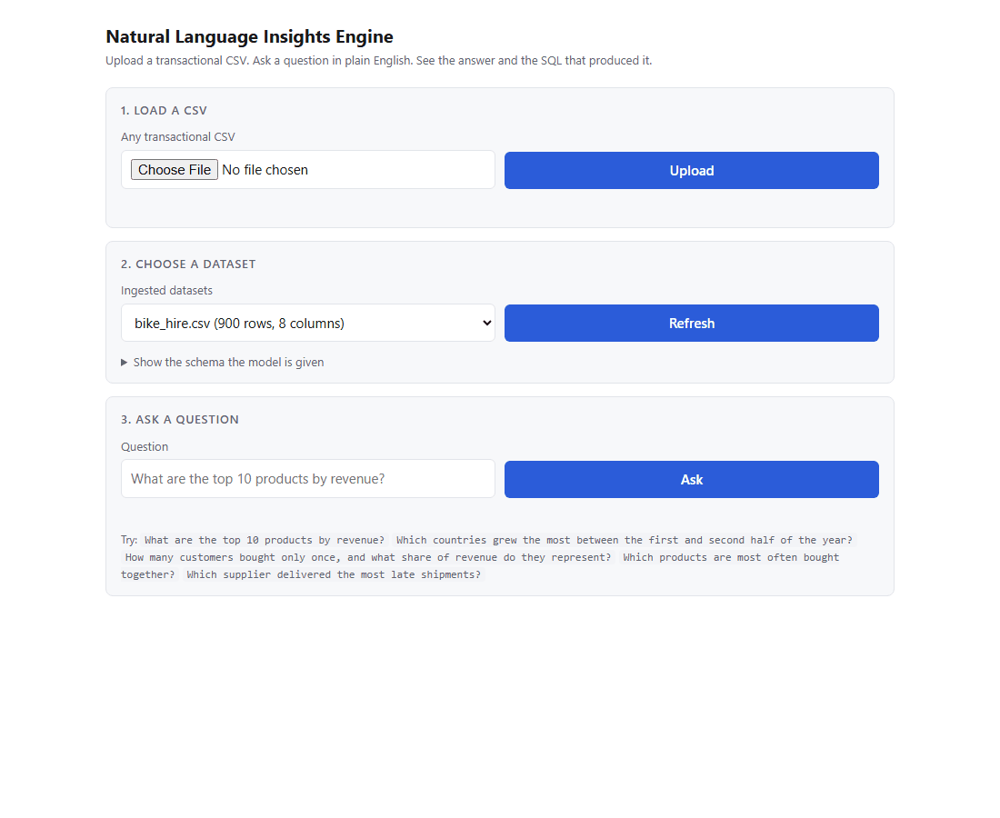

# Natural Language Insights Engine

Upload a transactional CSV. Ask a question in plain English. Get an answer and
the SQL that produced it.

The app has never seen your file before. It reads the file, measures every
column, and builds the description the model works from at that moment. Nothing
about any particular dataset is written into the code, the prompts or the
config. When a question cannot be answered from the columns in your file, the
app says so and names what is missing rather than guessing.

## What it looks like

Asking a question and seeing the SQL behind the answer:



Refusing a question the data cannot answer:


A second CSV the app has never seen, uploaded and queried, with no code changes:



## Requirements

* Python 3.11 or newer
* [Ollama](https://ollama.com/download), with one model pulled

The app talks to a local model. That means no API key and no network calls when
you ask a question.

## Run it

### Option one, on your machine

```bash
ollama serve                      # in its own terminal, if it is not already running
ollama pull qwen2.5-coder:7b      # about 4.7 GB, once
```

Then, from the repository:

```bash
./scripts/run.sh                  # macOS and Linux
```

```powershell
.\scripts\run.ps1                 # Windows
```

The script creates a virtual environment, installs the project and starts the
service. Open http://127.0.0.1:8000.

### Option two, Docker

```bash
docker compose up
```

Compose starts the model server, pulls the model into it, and starts the API
once the pull has finished. The first run downloads about 4.7 GB of weights.
Later runs reuse the volume and start in seconds.

Note that the Docker path is written but has not been run, because the machine
this was built on has no Docker installed. The Python path above was verified
from a clean clone. See `docs/status.md`.

## Ask a question through the UI

1. Open http://127.0.0.1:8000
2. Choose a CSV and press **Upload**. The page shows the row and column count
   when the file has been read.
3. Type a question and press **Ask**.

The answer panel shows one sentence describing what was computed, the rows, and
the SQL that produced them. Open **Show the schema the model is given** to see
exactly what the model knew when it wrote that query. That panel is the first
place to look when an answer surprises you.

## Ask a question through the API

The API never makes you wait. Uploading a file and asking a question both return
a job id straight away, and you poll for the result.

### 1. Upload a CSV

```bash
curl -s -F "file=@eval/data/bike_hire.csv" \
  http://127.0.0.1:8000/api/datasets
```

```json
{"job_id": "4964c18caed54729b70c401e83fea99e", "status": "queued"}
```

### 2. Poll until it is ingested

```bash
curl -s http://127.0.0.1:8000/api/jobs/4964c18caed54729b70c401e83fea99e
```

The job carries the dataset id and the measured profile once it succeeds.

### 3. Ask

```bash
curl -s -X POST \
  http://127.0.0.1:8000/api/datasets/b210961f83004401ad9a40216d0fdad0/questions \
  -H 'Content-Type: application/json' \
  -d '{"question": "Which 3 stations brought in the most in fees?"}'
```

```json
{"job_id": "30667ec8cccc45f29fba1f55833ef88d", "status": "queued"}
```

### 4. Poll for the answer

```bash
curl -s http://127.0.0.1:8000/api/jobs/30667ec8cccc45f29fba1f55833ef88d
```

```json
{
  "job_id": "30667ec8cccc45f29fba1f55833ef88d",
  "kind": "question",
  "status": "succeeded",
  "created_at": "2026-09-26T13:20:04.161937Z",
  "finished_at": "2026-09-26T13:20:14.565158Z",
  "dataset_id": "b210961f83004401ad9a40216d0fdad0",
  "result": {
    "question": "Which 3 stations brought in the most in fees?",
    "outcome": "query",
    "reason": "The query calculates the total fees charged at each station and returns the top 3 stations with the highest fees.",
    "sql": "SELECT \"Station\", SUM(\"Fee Charged\") AS Total_Fees FROM \"ds_b210961f83004401ad9a40216d0fdad0\" GROUP BY \"Station\" ORDER BY Total_Fees DESC LIMIT 3",
    "result": {
      "columns": ["Station", "Total_Fees"],
      "rows": [
        ["Kings Cross", 1366.1399999999996],
        ["Waterloo", 796.0200000000007],
        ["Camden Lock", 643.7199999999999]
      ],
      "row_count": 3,
      "truncated": false,
      "duration_ms": 4
    },
    "model": "qwen2.5-coder:7b",
    "planning_ms": 10345
  },
  "error": null
}
```

That response is a real one, copied from a run against a clean clone.

### When the data cannot answer

A refusal is a successful job, not an error. The outcome is `refusal`, `sql` is
null, and `reason` names what is missing.

```json
{
  "outcome": "refusal",
  "sql": null,
  "reason": "The question asks for a supplier, but there is no column that identifies suppliers in the given table."
}
```

### All the endpoints

| Method | Path | What it does |
| --- | --- | --- |
| `POST` | `/api/datasets` | Upload a CSV. Returns a job id. |
| `GET` | `/api/datasets` | List ingested datasets. |
| `GET` | `/api/datasets/{id}` | The full measured profile. |
| `GET` | `/api/datasets/{id}/context` | What the model is told about this dataset. |
| `POST` | `/api/datasets/{id}/questions` | Ask a question. Returns a job id. |
| `GET` | `/api/jobs/{id}` | Poll a job. Carries the result once it has one. |
| `GET` | `/health` | Liveness. Touches neither the model nor the database. |

Interactive docs are at http://127.0.0.1:8000/docs.

### Errors

Every error has the same shape, with a stable `code` you can branch on and a
`message` for a person to read. No stack traces are ever returned.

```json
{"error": {"code": "dataset_not_found", "message": "No dataset with that id has been ingested", "details": {"dataset_id": "nope"}}}
```

| Code | Status | Meaning |
| --- | --- | --- |
| `invalid_request` | 422 | The request body did not match the endpoint. |
| `invalid_file` | 400 | Not a CSV, empty, or over the size limit. |
| `ingestion_failed` | 400 | The file was read but could not be used. |
| `dataset_not_found` | 404 | No dataset with that id. |
| `job_not_found` | 404 | No job with that id. |
| `unsafe_query` | 400 | The generated SQL was refused by the validator. |
| `query_failed` | 400 | The SQL ran and the database rejected it. |
| `query_timeout` | 504 | The query ran longer than allowed and was cancelled. |
| `llm_unavailable` | 503 | The model server could not be reached. |
| `planning_failed` | 502 | The model returned something unusable. |

## Configure it

Every setting is an environment variable prefixed with `INSIGHTS_`. You can also
put them in a `.env` file in the repository root. There is no API key to set,
because the model is local.

| Variable | Default | What it does |
| --- | --- | --- |
| `INSIGHTS_OLLAMA_HOST` | `http://localhost:11434` | Where the model server is. |
| `INSIGHTS_OLLAMA_MODEL` | `qwen2.5-coder:7b` | Which model to use. |
| `INSIGHTS_LLM_PROVIDER` | `ollama` | Which client to build. |
| `INSIGHTS_LLM_TIMEOUT_SECONDS` | `120` | How long to wait for a plan. |
| `INSIGHTS_LLM_CONTEXT_TOKENS` | `8192` | Context window to ask the server for. |
| `INSIGHTS_DATA_DIR` | `data` | Where the DuckDB file and uploads live. |
| `INSIGHTS_MAX_CSV_BYTES` | `1000000000` | Largest upload accepted. |
| `INSIGHTS_MAX_RESULT_ROWS` | `1000` | Most rows returned for one question. |
| `INSIGHTS_QUERY_TIMEOUT_SECONDS` | `30` | How long one query may run. |
| `INSIGHTS_JOB_WORKERS` | `4` | How many jobs may run at once. |
| `INSIGHTS_MAX_CONTEXT_COLUMNS` | `150` | Most columns described in a prompt. |
| `INSIGHTS_HOST` / `INSIGHTS_PORT` | `127.0.0.1` / `8000` | Where the API listens. |

To use a different model:

```bash
ollama pull qwen2.5-coder:14b
INSIGHTS_OLLAMA_MODEL=qwen2.5-coder:14b ./scripts/run.sh
```

## Use it from the command line

The command line calls the same functions the API does, so answers are identical.

```bash
.venv/bin/python -m insights.cli ingest path/to/file.csv   # prints the profile
.venv/bin/python -m insights.cli list
.venv/bin/python -m insights.cli context <dataset_id>      # what the model sees
.venv/bin/python -m insights.cli ask <dataset_id> "your question"
```

## Tests

```bash
.venv/bin/python -m pytest
```

204 tests, and none of them touch a network. The model is scripted, so a test
never fails because a 7B model had an off day.

Tests that do use the real model are excluded by default:

```bash
.venv/bin/python -m pytest -m integration    # needs Ollama running
```

GitHub Actions runs the default suite on every push.

## Evaluation

Test questions with known right answers, including questions that cannot be
answered and where refusing is the only correct outcome.

```bash
.venv/bin/python -m insights.evaluation             # needs Ollama running
.venv/bin/python -m insights.evaluation --check     # validates suites, no model needed
```

A case records its right answer as SQL rather than as a number, so the expected
answer is recomputed from the data on every run.

Latest results, on `qwen2.5-coder:7b`:

| Suite | Passed | Refusals correct |
| --- | --- | --- |
| Bike hire, 900 rows, 8 columns | 13 of 14 | 4 of 4 |
| Library loans, 300 rows, 9 columns | 9 of 9 | 4 of 4 |
| Online retail, 511,395 rows, 25 columns | 6 of 10 | 4 of 4 |
| **Total** | **28 of 33** | **12 of 12** |

The number that matters most is the last one. Across all three suites the system
never answered a question the data could not support. The failures are all
questions it should have answered and got wrong, or refused when it should not
have. Where those failures are and why is in
[docs/system-design.md](docs/system-design.md).

## The development dataset

The suites above use two small CSVs that are committed. The third uses the UCI
Online Retail dataset, which is 78 MB and is not in the repository. To run that
suite, put a CSV at `online_retail_clean.csv` in the repository root. Any
transactional CSV works; nothing in the code depends on that one.

## Where to read next

| Document | What is in it |
| --- | --- |
| [docs/learn-this-project.md](docs/learn-this-project.md) | A guide from first principles, for someone new to SQL, APIs and databases. Start here. |
| [docs/system-design.md](docs/system-design.md) | The components, the path a question takes, the big decisions, and what I cut. |
| [docs/walkthrough-notes.md](docs/walkthrough-notes.md) | Every component in plain language, and every SQL query explained clause by clause. |
| [docs/decisions.md](docs/decisions.md) | The decision log, written as each slice landed. |
| [docs/assumptions.md](docs/assumptions.md) | Every judgement call made where the brief did not say. |
| [docs/status.md](docs/status.md) | What is done, what is not, and what was never verified. |
