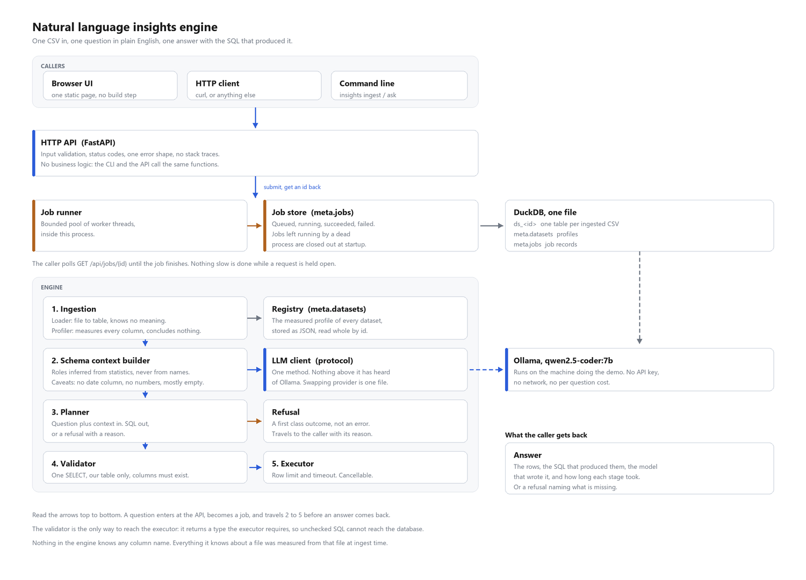
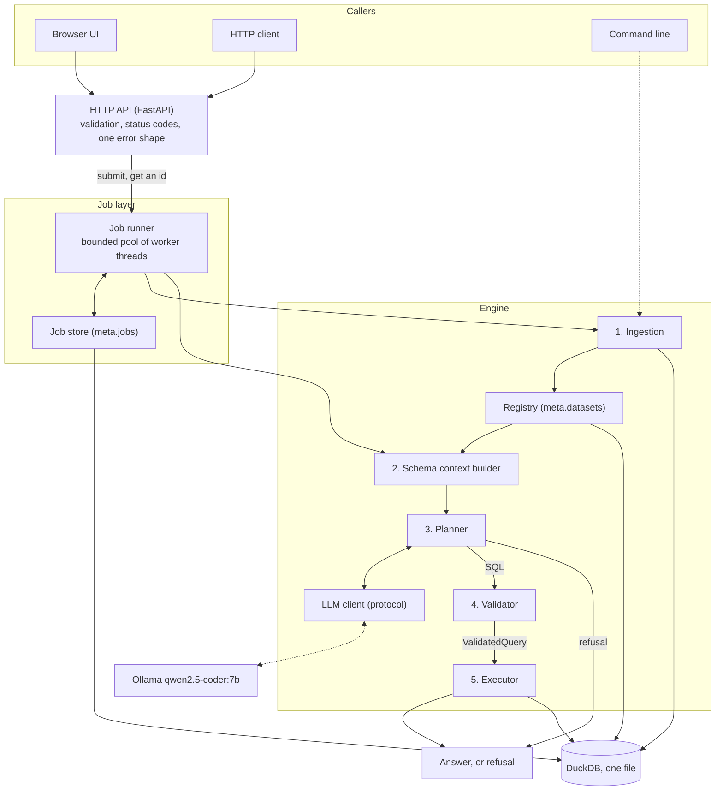

# System design

A merchandising team wants to ask questions of a CSV in plain English and trust
the answer. This document covers what the components are, the path a question
takes, how the schema context is built from a file nobody has seen, the biggest
decisions, what I would build next, and what I cut.



<details>
<summary>The same diagram as Mermaid source</summary>



</details>

## The components, and what each one owns

| Component | Owns | Does not own |
| --- | --- | --- |
| **Loader** `ingest/loader.py` | Getting rows out of a file and into a table. | Any idea of what the data means. |
| **Profiler** `ingest/profiler.py` | Measuring every column: type, nulls, distinct count, range, typical values, text length. | Any conclusion drawn from those measurements. |
| **Registry** `registry.py` | Remembering each dataset's profile, keyed by id. | Interpreting it. |
| **Context builder** `context/` | Turning measurements into the description the model sees. Inferring roles. Naming caveats. | Reading the file. It never touches the data again. |
| **Planner** `planner/` | Getting a decision out of a model and turning it into a value. | Deciding whether the SQL is safe or correct. |
| **LLM client** `llm/` | Talking to one model provider. | Anything about questions or SQL. |
| **Validator** `validator.py` | Deciding whether generated SQL may run. | Running it. |
| **Executor** `executor.py` | Running a validated query under a row limit and a timeout. | Deciding what is safe. |
| **Job layer** `jobs/` | Queueing work, recording status, surviving a restart. | The work itself. |
| **API** `api/` | Input validation, status codes, one error shape, serialisation. | Business logic. There is none here. |
| **Evaluation** `evaluation/` | Measuring whether answers are right and refusals are correct. | Anything the running system depends on. |

Three of these boundaries do real work and are worth calling out.

**Loader, profiler, context builder.** The loader measures nothing. The profiler
concludes nothing. The context builder interprets without re-reading the file.
So when the interpretation turns out to be wrong, and on an unfamiliar CSV it
will, one file changes and no data has to be read again. This split paid for
itself twice during the build: both times the fix for a wrong answer was three
lines in the context builder.

**Planner, validator, executor.** The planner produces text. The validator
decides whether that text may run. The executor runs it under limits. Each is
testable alone, and none of them can quietly take on another's job.

**Validator to executor, enforced by a type.** `validate_sql` returns a
`ValidatedQuery`, and `run_query` accepts nothing else. A future caller cannot
skip validation by passing a string, because the signature will not take one.
There is a test that fails if that signature is loosened.

## The path a question takes

1. **`POST /api/datasets/{id}/questions`.** The API checks the body, looks up the
   dataset so a bad id is a 404 now rather than a job that fails a moment later,
   submits a job and returns `202` with a job id. Nothing slow has happened yet.
2. **A worker thread picks the job up.** It takes its own database handle. The
   job row is written before the work is queued, so the caller's first poll
   cannot 404.
3. **The profile is loaded** from the registry by dataset id. No file is read.
4. **The context builder interprets it.** Roles per column, caveats about the
   file, and a rendered text block. This is everything the model will know.
5. **The planner asks the model** for JSON constrained to a schema:
   `answerable`, `reason`, `sql`, in that order. If `answerable` is false, or if
   it is true with no SQL, the job succeeds with a refusal and nothing touches
   the database.
6. **The validator checks the SQL.** One statement, a SELECT, reading only this
   dataset's table, with columns that resolve. Anything else raises and the job
   fails with a structured reason.
7. **The executor runs it** on a worker thread with a row limit and a timeout,
   fetching one row beyond the limit so it can tell the caller the result was
   truncated.
8. **The job is marked succeeded** with the answer: the rows, the SQL, the
   sentence describing what was computed, the model, and the timings.
9. **The caller polls `GET /api/jobs/{id}`** and gets it.

A refusal takes the same path and stops at step 5. It is a successful job, not
an error, because a question the data cannot answer has a correct answer and
that answer is "no".

## How schema context is built from an unfamiliar file

This is the part the whole "any CSV" requirement rests on.

### What is measured

DuckDB reads the file and infers a type per column. Types are inferred from the
**whole file** rather than a sample. That costs about half a second on 78 MB and
buys correctness on a column that looks like an integer for twenty thousand rows
and turns messy at row four hundred thousand.

Then one query with seven aggregates per column measures, for every column: how
many values are not null, how many are distinct, the range for ordered types,
the mean for numbers, and the mean and maximum length for text. One query, so
the table is scanned once instead of once per column. A second query per column
collects the five most frequent values.

### What is inferred, and the decision behind it

Roles are inferred from **statistics only, never from column names**.

The obvious design is a token list: a column whose name contains "price" is
money, one containing "date" is a date. I rejected it, and the reason is the
most defensible decision in the build:

> The model already reads the column names. Whatever a column is called, the
> model can see what it is called. A name matching heuristic adds a second,
> worse opinion about the same evidence. It contradicts the name on any file not
> written in English business vocabulary, and it has to be maintained forever.
> What the model cannot see is that a column has 38 distinct values across half
> a million rows, or that a quarter of it is empty, or that its values average
> six characters. That is what this module contributes, and it is all it
> contributes.

The roles are structural, not semantic:

| Role | Inferred from |
| --- | --- |
| `temporal` | the column's type is a date, timestamp or time |
| `flag` | boolean, or an integer whose measured minimum and maximum are 0 and 1 |
| `identifier` | at least 95% of non null values are distinct, over at least 20 values |
| `key` | text, many distinct short values, each repeated |
| `category` | text, at most 50 distinct values |
| `free_text` | text averaging over 40 characters, or one value over 200 |
| `measure` | any other number |
| `unknown` | entirely empty, or a type we do not model |

The accepted cost: this does not claim to tell a price from a count. Both are
`measure`. That distinction is a claim about meaning and the only evidence for
it is the name, which the model has. Every threshold is a setting, because every
one of them is a judgement call, and each role carries the measurement it came
from so a wrong guess can be explained rather than argued about.

### The caveats, which are what make refusing possible

The builder also states facts about the file as a whole:

* **No temporal column.** "Questions about periods, growth, trends or between
  two quarters cannot be answered from this data." This single line is the
  difference between refusing a question about growth and inventing an answer to
  it, and it costs nothing to compute.
* **No measure column.** Totals, averages and rankings by value are impossible.
* **No header row found.** The names are positional and carry no meaning.
* **Types could not be inferred.** Every column is text and casts may fail.
* **Mostly empty columns**, named, because any figure grouped by one covers only
  part of the data.

A refusal that says "there is no date column in this file" is useful. One that
says "I cannot answer that" is not.

### Where it breaks

* **A file with no header.** DuckDB does not error. It decides there is no
  header, names the columns `column0`, `column1`, and treats the header row as
  data. The profile records `header_detected: false` and the context says the
  names mean nothing, but nothing recovers what those columns were.
* **Column names that mean nothing to a model.** `col_a`, `f1`, `x7`. The
  statistics still hold, so the roles are still right, but no amount of role
  inference recovers what `f1` means. This is where a semantic layer stops being
  optional.
* **A very wide file.** 150 columns is the prompt budget. Beyond that, columns
  are dropped and a caveat says how many. The planner is then working from a
  partial picture, which is stated but not solved.
* **A file bigger than memory.** The load streams, but counting distinct values
  across every column at once does not. A ten gigabyte file would be slow rather
  than wrong.
* **Threshold cliffs.** A text column with 51 distinct values is a `key`; with
  50 it is a `category`. Nothing bad happens, since both render with their
  distinct count, but the role flips on one row's worth of data.
* **Non UTF-8 encodings.** DuckDB assumes UTF-8. A Latin-1 file with an accented
  character will mis-decode or fail, and nothing detects or converts it.
* **One table per file.** There are no joins across datasets. That is a
  deliberate limit that the validator enforces.

## The four biggest decisions

### 1. DuckDB, in process, as the whole storage layer

**Chosen because** it reads CSV natively, infers types, runs analytical
aggregates fast, and is a single file with no server. The profile of a 78 MB,
511,395 row, 25 column file takes about 2.9 seconds end to end.

**Rejected: Postgres.** Needs a server, a container and a COPY step, which works
against a fifteen minute setup on a clean machine.

**Rejected: SQLite.** No CSV sniffing, and everything is text shaped.

**Rejected: pandas for the profiling.** It would mean pulling 500,000 rows into
Python memory to compute what the database computes in one scan without leaving
C++. Using DuckDB for both means one engine, one set of type semantics, and one
definition of what null means.

**The cost, which shapes everything downstream:** DuckDB allows one writing
process. That is why the job workers are threads inside the API process rather
than a separate worker service. A separate process could not write to the same
file. This is a consequence of the storage choice, not a shortcut, and it is the
honest answer to "why not Celery".

### 2. Roles from statistics, never from column names

Covered in full above. It is the decision that makes the "any CSV" requirement
actually hold rather than hold for files that use English retail vocabulary.

The guard that keeps it true is a test: `tests/test_no_dataset_knowledge.py`
scans every file under `src/` for the 27 column names in the development dataset
and fails if one appears. It runs in CI. It caught me once, on a docstring that
used a real column name as an example.

### 3. Refusal is a return value, not an exception

`plan_query` returns a plan that is either a query or a refusal. Both are
successes. Nothing raises, nothing is caught, and the refusal travels to the
caller as a value with its reason attached. Exceptions are for things that went
wrong.

The corollary is the decision most likely to be argued with. When the model says
"answerable", writes SQL, and the SQL names a column that does not exist, that
is an **error**, not a refusal. Both outcomes show the user no number, so
"never invent a number" holds either way. The difference is diagnosis:

* a refusal says *your data cannot answer this*
* an error says *the planner malfunctioned*

Collapsing the second into the first would hide planner failures behind language
that sounds correct, and would corrupt the one measurement that tells us whether
the model is any good. The evaluation harness counts "correctly refused"
separately from "produced SQL that does not resolve", and it can only do that if
they are different outcomes.

**Rejected: retrying a refusal with a stronger instruction.** A system that
argues with its own refusals until they go away is a system that does not
refuse.

### 4. A validator that parses, not one that reads

The first version was a keyword scan. It was labelled provisional in the source
and replaced, because a keyword scan reads text rather than understanding it. It
rejected `WHERE "Branch Library" = 'Central;York'` as two statements, and it
rejected a column literally named `drop table t; --`, of which there is one in
the test fixtures. A guard that fires on valid queries is not a safe guard, it
is a broken product.

The replacement runs four checks, and the point is that each is done by whatever
is best able to do it rather than by code written here:

| Question | Answered by | Why not by hand |
| --- | --- | --- |
| One statement, and a SELECT? | DuckDB's own parser | It knows a semicolon inside a literal ends nothing. |
| Reads only our table? | sqlglot AST walk, against an allowlist | Nothing else enforces our policy about which tables. |
| Do the columns exist? | DuckDB's binder, via `EXPLAIN` | Doing it by hand means re-implementing SQL name resolution, and getting aliases and CTEs subtly wrong. |
| Does it finish? | the executor | It is a limit at execution time, not a property of the text. |

The table check is an **allowlist**, not a list of forbidden things. A denylist
would have to anticipate every way DuckDB can be pointed at data: `read_csv`,
`read_parquet`, a bare file path, a schema qualified name, an extension
installed later. It only has to be incomplete once. The case a denylist would
never have caught is **another dataset's table**, because `ds_a1b2...` looks
exactly like the table we do allow.

The order of the checks is load bearing and is pinned by a test. The allowlist
runs before the database is asked to bind the statement, because binding is not
free of consequences:

```
EXPLAIN SELECT * FROM read_csv('<a path that does not exist>')
  -> IO Error: No files found that match the pattern ...
EXPLAIN SELECT * FROM read_csv('<a path that does exist>')
  -> succeeds, and the plan contains that file's column names
```

DuckDB opens the file at plan time to work out its schema. Asking the binder
first would leak whether an arbitrary path exists and what is in it, without
running a query at all.

**The residual risk, stated plainly:** two parsers see the statement. sqlglot
decides which tables are read and DuckDB decides what runs. If they ever
disagree, the allowlist could be walked around. That is inherent in using a
second parser, and DuckDB exposes no API to enumerate a statement's tables.

## How well it works

Measured by the evaluation harness, on `qwen2.5-coder:7b`:

| Suite | Shape | Passed | Refusals correct |
| --- | --- | --- | --- |
| Bike hire | 900 rows, 8 columns | 13 of 14 | 4 of 4 |
| Library loans | 300 rows, 9 columns | 9 of 9 | 4 of 4 |
| Online retail | 511,395 rows, 25 columns | 6 of 10 | 4 of 4 |

**Twelve of twelve unanswerable questions were refused.** Across three files the
system never invented an answer. That is the number the brief cares most about
and it is the one that holds up.

The failures are worth being precise about, because they are all the same shape.
Every one of them is a question whose answer has to be **derived** rather than
looked up:

* "Which countries grew the most between two quarters." Needs two filtered
  aggregates over one column and a comparison between them.
* "How many customers bought only once." Needs a count per customer, then a
  filter on that count.
* "What share of revenue do they represent." Needs the part and the whole in one
  query.
* "Which products are bought together." Needs the table joined to itself.

The model answers direct aggregations reliably and loses the thread on two step
derivations. Note where the failures are not: the same shapes pass on the eight
column bike hire file, including growth between two quarters. The retail file
has 25 columns, several of them flags that look relevant and are not. The
failure is the model's reasoning under a wider schema, not the pipeline.

I tried twice to fix this with the prompt and stopped. A generic rule about
calculated answers helped the small file and did nothing for the large one, and
tuning further would have meant fitting the prompt to one dataset, which is the
thing the brief warns against. The honest fix is a bigger model or a self repair
loop, and both are in the next section.

One more honest note: temperature is zero, and the answers are still not
perfectly reproducible. The same question produced Kings Cross on one run and
Waterloo on another. Greedy sampling removes one source of variation and batching
inside the inference server is another.

## What I would build next, in order

1. **A self repair loop for invalid SQL.** When the validator rejects a query,
   hand the binder's error back to the model and let it try once more. This is
   the highest value change for a small model: the errors are precise and
   actionable. It costs one extra round trip on the failure path only. I would
   gate it behind a retry budget and count repairs in the evaluation output, so
   a rising repair rate is visible rather than hidden.
2. **A bigger model behind the same seam.** The LLM client is a protocol with
   one method. Pointing it at a 14B model or at a hosted frontier model is one
   file and one setting. I would run the evaluation suites against two or three
   models and publish the table, which turns "which model" from an opinion into
   a measurement.
3. **A semantic layer.** Let a user say "revenue means this column" or "a
   customer is this column", and store it beside the profile. It lands cleanly
   as a user supplied override on `ColumnContext`, applied after inference and
   rendered as a stated fact rather than a guess. This is what makes files with
   meaningless column names usable, and it is the first thing a real
   merchandising team would ask for.
4. **Question level caching.** Same dataset and same question means the same
   answer. Keyed on the dataset id and the normalised question, invalidated when
   the dataset changes. Cheap, and it makes the demo feel instant.
5. **Column selection for wide files.** Today a file over 150 columns has
   columns dropped and a caveat added. Better is to select the columns relevant
   to the question, which needs a cheap retrieval step over column descriptions
   before the planning call.
6. **Structured tracing.** One trace id from HTTP request through job, plan,
   validation and execution, with the prompt and the raw model response
   recorded. Right now diagnosing a wrong answer means re-running it by hand.

## What I cut

Each of these was a decision, not an oversight.

**Streaming progress on jobs.** Polling is enough. The work here has no
meaningful progress between "started" and "finished", and a progress bar that
moves for no reason is a lie. Server sent events would have been a second
transport to test for no information gain.

**A separate worker process or a real queue.** DuckDB allows one writing
process, so a separate worker could not write to the same file. Adding Redis and
Celery would mean two more moving parts, a second thing to install, and a
storage engine the workers still could not write to. Threads inside the API
process is the shape that fits the storage engine. The limit is real and is
written down: this scales up, not out.

**Crash recovery of in flight work.** A job interrupted by a restart is marked
failed, not resumed. Resuming would mean making every job idempotent and
restartable, which is a large amount of machinery for a service whose longest
job is a few seconds. Telling the caller the truth costs eight lines.

**Orphan table cleanup.** If the process dies between creating a table and
registering it, the table is orphaned. A sweep for `ds_*` tables with no
registry row would fix it. It is a few lines and it has not mattered once, so it
waits until it does.

**Authentication and multi tenancy.** Out of scope in the brief. Every caller
sees every dataset.

**Charts.** Listed as optional. A chart is a second way of being wrong about the
same number, and the number and its SQL are what build trust.

**Cost tracking.** The model is local. The marginal cost of a question is
electricity.

**Retrying refusals.** Argued above. A system that argues with its own refusals
until they go away does not refuse.

**A synchronous question endpoint.** It would be convenient for curl and would
mean two code paths to keep in step, plus an invitation to use the one that
times out. The README shows the two step flow instead.

**Verifying the Docker path.** This machine has no Docker. The Dockerfile and
compose file are written and reviewed but have never been run. The Python path
is verified from a clean clone and is the one the README recommends first. I
would rather say this than claim a green tick I did not earn.
